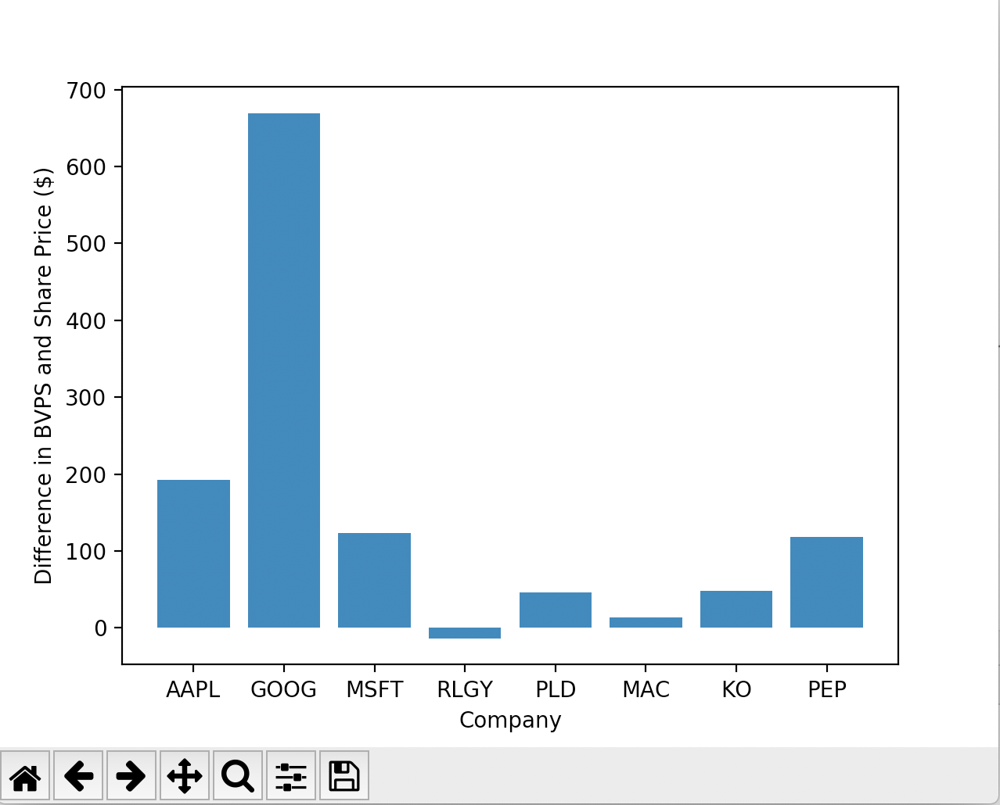
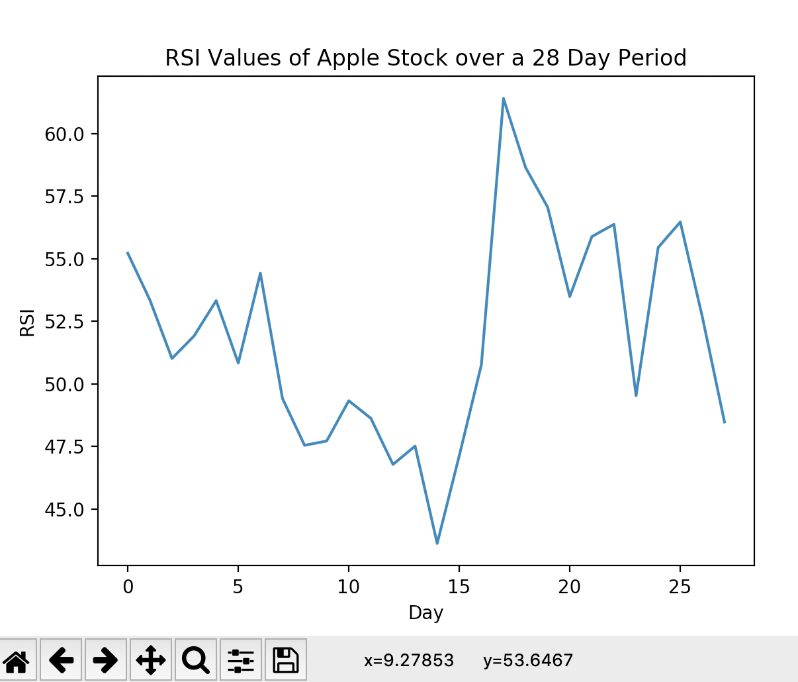

# Stock-Strength
I dabble with web scraping and financial APIs to obtain financial data of publicly traded companies (mainly Apple to begin with) and use metrics such as the relative strength index and comparisons of market value and book value of stocks to determine whether investing in the company stock at the moment is worth it.

In conducting my analysis of the book value per share (BVPS) and market price of a company (see image below) it becomes evident that certain sectors have a higher difference between these two metrics than others. Three industries were used in my analysis, with three companies representing each industry. The industries and companies are outlined below:

Technology/Software:Apple, Google, Microsoft

Real Estate: Realogy Holdings, Prologis, Macerich

Food/Beverage:Coca-Cola, Pepsi, Dr. Pepper

Based on the graph, technology companies (the first three companies on the graph) have higher BVPS's relative to their market price than real estate and food and beverage companies (the middle three companies are real estate companies while the final three are food/beverage companies). This does not mean that the selected technology companies are overvalued and real estate and food and beverage companies are undervalued. Rather the stark difference between across these sectors suggests higher consumer optimism (and perhaps customer loyalty) in the technology field than in the real estate and food and beverage industries. 

The results suggest that pure numerical analysis cannot be enough in determining whether a company is worth investing in. Human sentiment plays a major role in the values of corporations on the stock market. 

Please note: to use this code yourself, you must create your own IEX Cloud API account and obtain your own API token. Since I only have the free version, I can no longer access certain data points after a recent update in policy and only have a limited number of calls for data points I can access. 

API URL example: https://cloud.iexapis.com/v1/stock/COMPANY_NAME/balance-sheet/1/shareholderEquity?token=TOKEN_HERE

Next, I use the Relative Strength Index (RSI) as another numerical way to analyze the value of company stocks (currently for only one company, Apple). Using data of closing prices from the API Alpha Vantage, I calculate the RSI of the company stock for each day over a 28 day period (definition and formula for RSI from https://www.investopedia.com/terms/r/rsi.asp). The results are graphed using Python's matplotlib library. RSI values above 70 may indicate overvalued/overbought stocks and RSI values below 30 may indicate undervalued/oversold stocks. Below is the result for Apple:

On the x-axis, 28 will represent today, while 0 represents 28 days before today. During the current period, the RSI value stays between 30 and 70, indicating Apple stock is likely not oversold or overbought.

To get the data yourself, go to the Alpha Vantage and follow instructions for getting daily closing price data. The function name is TIME_SERIES_DAILY and you will get your own API key. 
